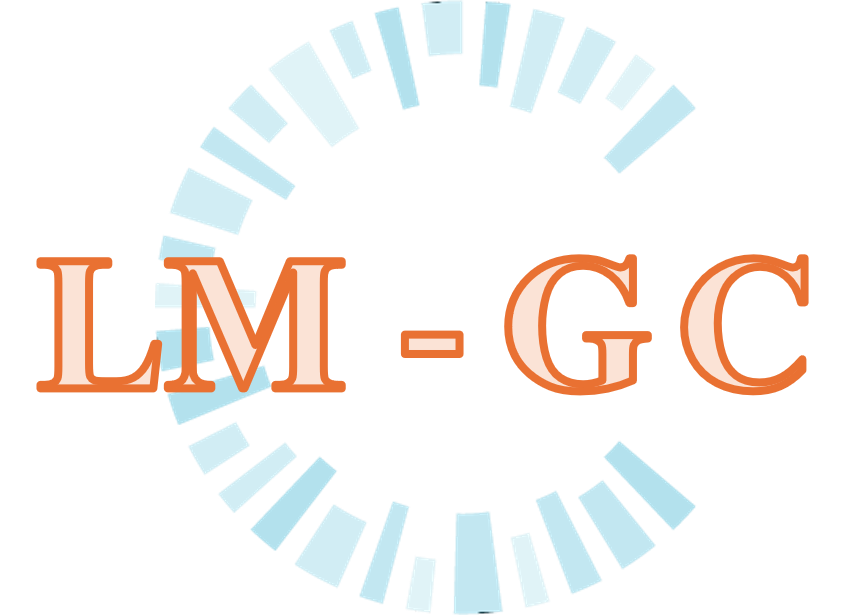
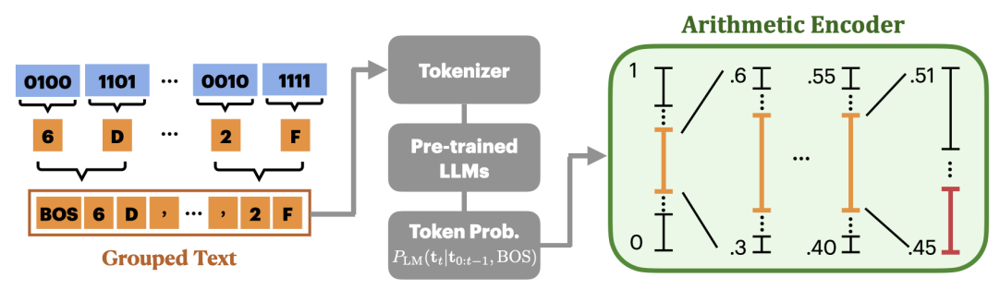

<br/>
<div align="center">

<br/>
<a href="https://github.com/ShaanCoding/ReadME-Generator">

</a>
<h3 align="center"></h3>
<p align="center">
The official implementation of "Language Models as Zero-shot Lossless Gradient Compressors: Towards General Neural Parameter Prior Models" published at NeurIPS 2024.
<br/>
<br/>
<a href="https://arxiv.org/abs/2409.17836">[Preprint]</a>  
</p>
</div>

## Overview



This project provides the source code of LM-GC, the first LLM-powered gradient compressor.

Here are takeaways:

- We demonstrate that large language models (LLMs) hold significant potential as prior models for gradients, a concept that has been widely applied in other modalities but gradients.
- We introduce a novel serialization method that converts IEEE 754 floating points into the hexadecimal format, enabling LLMs to comprehend and achieve state-of-the-art lossless gradient compression.
- Our LLM-based prior model could unlock new applications for gradients similar to those in other modalities, such as super-resolution, denoising, generation, and more.

<br/>

*If you find the project interesting, don't forget to star and cite our work:*

```bibtex
@article{wang2024language,
  title={Language Models as Zero-shot Lossless Gradient Compressors: Towards General Neural Parameter Prior Models},
  author={Wang, Hui-Po and Fritz, Mario},
  journal={Advances in Neural Information Processing Systems},
  year={2024}
}
```
## Getting Started
### Prerequisites

- torch ≥ 2.12.0
- transformers ≥ 4.40.1
- [torchac](https://github.com/fab-jul/torchac)
- [flash attention](https://huggingface.co/docs/transformers/perf_infer_gpu_one#flashattention-2) ≥ 2.5.8 via ```pip install flash-attn --no-build-isolation``` for NVIDIA GPUs

or

- install via ```pip```
   ```sh
   pip install -r requirements.txt
   ```
**After setting up the HuggingFace access token [here](https://github.com/hui-po-wang/LM-GC/blob/main/compressors/language_model.py#L57), ideally, the codebase will download language models automatically via HuggingFace except for LLAMA2. See [More LLMs](#more-llms) for more information.**

### Quickstart
We provide a quick demo here. Please refer to [Usage](#usage) for the detailed usage.
```bash
cd scripts
# compress gradients of a ConvNet trained on TinyImageNet using TinyLLAMA
bash pipeline.sh 
```
## Usage
It takes three steps to reproduce the experiments in the paper, including (1) training neural networks to collect gradients, (2) serializing and tokenizing raw gradients, (3) running LLMs and arithmetic (LM-GC).

### 1. Gradient collection
This step trains a network (e.g., a ConvNet on TinyImageNet in the following example) and collects gradients for compression later. See ```scripts/run_collect.sh``` for more details.
```bash
DATASET='tinyimagenet' # cifar10 # mnist
ARCH="convnet" # vgg16 # resnet18 # vit
for i in 0 1 2
do
    python -u train_and_collect_grad.py -cfg settings/gradient_collection/$DATASET-$ARCH.yaml --tag $i --grad-interval 400 --download
done
```
### 2. Serialization and tokenization
For convenience, we process the data before conducting arithmetic encoding. The data is serialized and tokenized here. We create three preprocessed datasets here. See ```scripts/serialization.sh``` for more details.
```bash
NUM_SUBSAMPLE=10
DATASET='tinyimagenet' # cifar10 # mnist
ARCH="convnet" # vgg16 # resnet18 # vit
TYPE="grad"
COMPRESSOR="tinyllama" # llama2-7b # openllama3b
SEP="hex-none" # hex-space # hex-comma+space # iso # hex-semicolon
BPG=4 # 8
for i in 1 2 3
do
  python -u tokenize_dataset.py --cfg settings/compression/cifar10-$SEP.yaml \ 
    --data-path exps/$DATASET-$ARCH/0/grads/ --bytes-per-group $BPG \
    --compressor $COMPRESSOR --exhaustive-listing --num-subsample $NUM_SUBSAMPLE \
    --output-name $ARCH-$DATASET-$COMPRESSOR-$SEP-$NUM_SUBSAMPLE-$TYPE-$BPG-$i 
done
```
### 3. Run compression
The processed data from the previous step is now divided into several disjoint windows. By default, LLMs see a set of 2048 (including 1 BOS token) tokens every time. The experiments are repeated three times. See ```scripts/compress.sh``` for more details.
```bash
HF_DATASETS_OFFLINE=1 TRANSFORMERS_OFFLINE=1
NUM_SUBSAMPLE=10
DATASET='tinyimagenet' # cifar10 # mnist
ARCH="convnet" # vgg16 # resnet18 # vit
TYPE="grad"
COMPRESSOR="tinyllama" # llama2-7b # openllama3b
SEP="hex-none" # hex-space # hex-comma+space # iso # hex-semicolon
BATCHSIZE=4 # depending on your GPUs
BPG=4 # 8
for i in 1 2 3
do
  python -u compress.py -cfg settings/compression/cifar10-$SEP.yaml --compressor $COMPRESSOR --dataset tokenized_dataset \
    --data-path ./tokenized_datasets/$ARCH-$DATASET-$COMPRESSOR-$SEP-$NUM_SUBSAMPLE-$TYPE-$BPG-$i.pkl --batch-size $BATCHSIZE
done
```

## Options

### More LLMs

### More models to compress

### Ablation study
- Bytes per group
- Context window size

## TO-DO
- [x] prepare `pipeline.sh`
- [x] sanity check
- [ ] how to add more LLMs
- [ ] Provide a runnable encode/decode example
- [ ] Baseline codec
## License

Distributed under the MIT License. See [MIT License](https://opensource.org/licenses/MIT) for more information.

## Acknowledgments
This project is partially built upon [Deepmind's work](https://github.com/google-deepmind/language_modeling_is_compression), and the readme file template comes from [makeread.me](https://github.com/ShaanCoding/ReadME-Generator).
